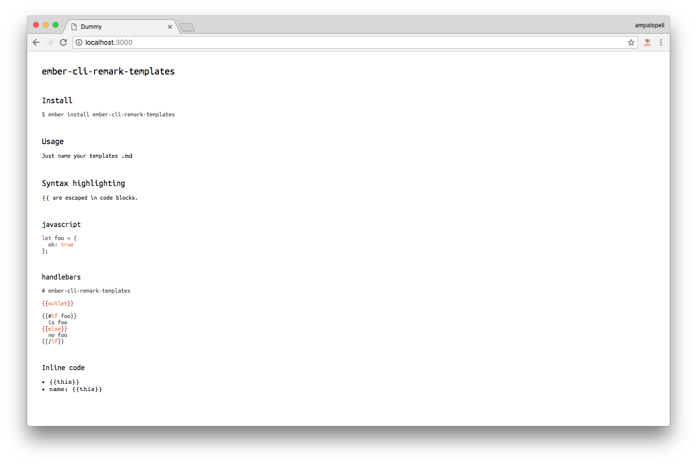

# ember-cli-remark-templates



Let's you use markdown to write Ember.js templates.

## Install

``` bash
$ ember install ember-cli-remark-templates
```

## Usage

Just name your templates `.md`

## Syntax highlighting

`{{` are escaped in code blocks.

### javascript

``` javascript
let foo = {
  ok: true
};
```

### handlebars

``` hbs
# ember-cli-remark-templates

{{outlet}}

{{#if foo}}
  is foo
{{else}}
  no foo
{{/if}}
```

### Inline code

* `{{this}}`
* `name: {{this}}`
